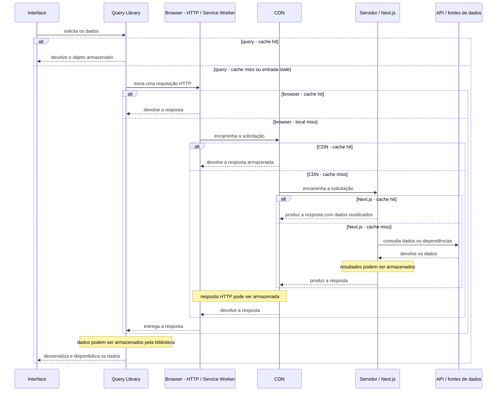
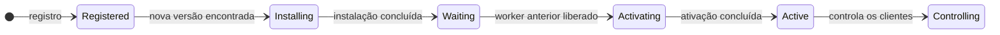
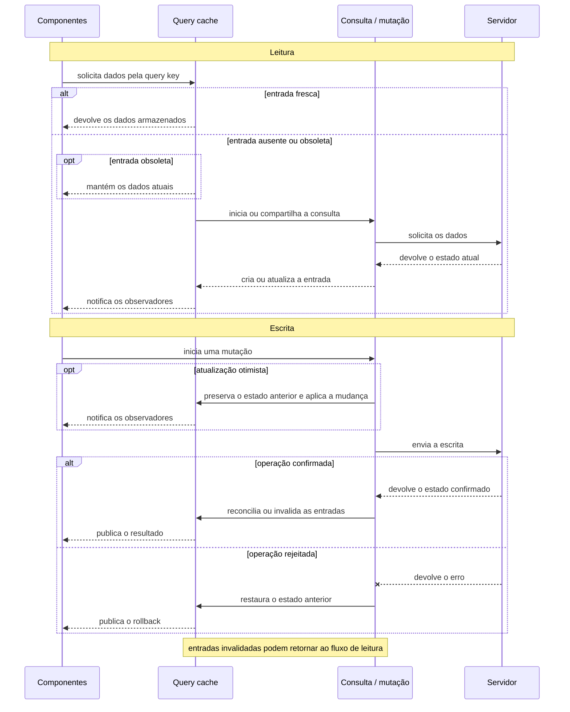

Quando desenvolvedores falam em cache, frequentemente usam a mesma palavra para descrever mecanismos distribuídos por pontos muito diferentes da arquitetura. No navegador, cache pode se referir ao mecanismo definido pelo protocolo HTTP — o cache HTTP — ou a uma resposta interceptada por um Service Worker. Também podemos estar falando de dados preservados no cliente por uma biblioteca como TanStack Query. Depois que uma requisição atravessa a rede, a CDN pode entregar uma representação de página armazenada anteriormente, antes mesmo que ela alcance o servidor da aplicação. Caso ainda precise avançar, um framework como Next.js pode reaproveitar resultados de funções, componentes ou rotas durante a produção da resposta.

Como se vê, “cache” pode significar muitas coisas, e as decisões tomadas em cada camada seguem ciclos independentes. Tomemos como exemplo uma alteração no preço de um produto do catálogo: a nova informação pode já estar disponível na API, enquanto a CDN continua entregando o HTML produzido anteriormente e uma aba aberta conserva o objeto recebido minutos antes. Esse conjunto de camadas só produz ganhos de desempenho com segurança **quando essa defasagem permanece dentro do limite aceito pelo produto** e quando representações destinadas a escopos diferentes não são tratadas como equivalentes.

Este artigo percorre esse caminho a partir do navegador até o servidor da aplicação. O foco está em quatro decisões que reaparecem em todas as camadas: **qual representação foi armazenada, como ela é identificada, por quanto tempo pode ser reutilizada e como uma versão posterior ocupa seu lugar**.

## 1. Representações ao longo das camadas de cache

Antes de acompanhar a solicitação pelas diferentes camadas, é preciso separar alguns conceitos que costumam aparecer misturados. Chamamos de **recurso** qualquer conteúdo identificado e acessado pela aplicação, como um arquivo JavaScript, uma imagem, um documento HTML ou os dados de um produto. A tentativa de obtê-lo sob determinadas condições forma uma **requisição**. A **resposta** é o resultado dessa tentativa, composta por status, cabeçalhos e, quando aplicável, um corpo. Já a **representação** é a forma concreta assumida por esse recurso ao ser produzido, entregue ou armazenado em determinada camada da arquitetura.

Em uma aplicação de comércio eletrônico, considere a solicitação:

```http
GET /api/products/123
Accept-Language: pt-BR
```

O **recurso** é o produto identificado por `123`. A **requisição** informa qual recurso está sendo solicitado e sob quais condições, como idioma, moeda, região ou autenticação. Para atendê-la, a API pode combinar o cadastro e a descrição armazenados em um banco de catálogo com o preço calculado por um serviço separado. Parte desse resultado também pode estar temporariamente disponível em um armazenamento como Redis.

A operação pode produzir esta **resposta**:

```http
HTTP/1.1 200 OK
Content-Type: application/json
Cache-Control: public, max-age=0, s-maxage=300
```

```json
{
  "id": "123",
  "name": "Tênis de corrida",
  "price": 499.9,
  "available": true
}
```

O corpo JSON é uma **representação** dos dados daquele produto, produzida para as condições da **requisição**. A mesma entidade de negócio — o produto `123` — pode aparecer em outras representações em diferentes pontos da aplicação: incorporada ao HTML da página, armazenada como parte de uma resposta HTTP na CDN ou convertida em um objeto desserializado no navegador por uma biblioteca de estado como TanStack Query, SWR ou RTK Query. Essas representações se referem ao mesmo produto, mas possuem formatos, identidades e ciclos de vida diferentes.

### Como as camadas se relacionam

A solicitação do exemplo pode atravessar diferentes camadas, e a **resposta** produzida pode ser armazenada durante o caminho de retorno. A posição de cada representação depende da arquitetura e das estratégias definidas para a aplicação. Nem todos os projetos utilizam as mesmas tecnologias ou possuem os mesmos requisitos; por isso, diferentes tipos de **recurso** podem seguir trajetos distintos.

O diagrama abaixo representa um percurso possível para uma resposta HTTP, e não um fluxo fixo para todos os recursos da aplicação.



O comportamento geral permanece o mesmo: durante a solicitação, cada mecanismo verifica se possui uma representação capaz de atender ao pedido atual. Um acerto (`cache hit`) encerra o percurso naquele ponto; na ausência de uma entrada compatível (`cache miss`), a operação segue para a próxima camada. Quando uma nova resposta precisa ser produzida, ela percorre o caminho de volta e pode ser armazenada conforme as regras de cada cache.

Para decidir se existe uma entrada compatível, cada camada precisa reconstruir a identidade da solicitação atual e compará-la com as entradas que mantém. A URL costuma ser o ponto de partida, mas não resolve todos os casos: método, parâmetros, cabeçalhos, idioma, região, cookies e autenticação também podem alterar a representação produzida.

A composição usada para distinguir essas representações forma a **cache key**.

## 2. A identidade de uma entrada de cache

Antes de reutilizar uma resposta, o cache precisa determinar se a entrada armazenada corresponde à solicitação atual. Essa comparação depende de uma identidade formada pelo método, pelo endereço do recurso e pelas condições que alteram a representação produzida.

Não existe uma única chave compartilhada por todas as camadas. O cache HTTP do navegador e a CDN partem da requisição HTTP; o query cache utiliza uma identidade definida pela aplicação; o Next.js distingue resultados de funções, componentes e rotas. Nesta seção, o foco está na identidade das respostas HTTP, que será reutilizada pelas camadas do navegador e da CDN.

Considere duas solicitações para a mesma rota:

```http
GET /products?page=2&sort=price
```

```http
GET /products?page=2&sort=rating
```

O caminho é o mesmo, mas o parâmetro `sort` altera a organização dos produtos. Se as duas solicitações fossem tratadas como equivalentes, o cache poderia devolver uma resposta produzida para outro critério de ordenação.

Como modelo mental, a identidade pode ser representada por:

```text
método + URI + variantes relevantes
```

A composição concreta depende do cache e de sua configuração, mas o princípio permanece: duas solicitações só podem compartilhar uma entrada quando todas as diferenças capazes de alterar a resposta foram consideradas.

### Método, URL e parâmetros de consulta

No cache HTTP, o método e a URI formam a base da identidade. Em leituras realizadas por `GET`, o caminho e os parâmetros de consulta normalmente distinguem representações diferentes:

```http
GET /products?category=shoes&page=2
```

```http
GET /products?category=shoes&page=3
```

Nesse caso, `category` e `page` participam da resposta e precisam permanecer visíveis para o cache.

Nem todo parâmetro, porém, altera o conteúdo retornado:

```http
GET /products?category=shoes&utm_source=newsletter
```

Se a CDN considerar toda a query string, cada combinação de `utm_source`, `utm_campaign` e `gclid` poderá criar uma entrada diferente para a mesma página. A resposta continua equivalente, mas o cache fica fragmentado entre chaves que quase nunca serão reutilizadas.

A configuração pode normalizar a URL e separar parâmetros funcionais daqueles usados apenas para rastreamento:

```text
Alteram a resposta:
category, page, sort, currency

Não alteram a resposta:
utm_source, utm_campaign, gclid
```

Essa normalização precisa acompanhar o contrato da rota. Ignorar `currency=BRL`, por exemplo, seria incorreto se a moeda alterasse os preços exibidos.

A ordem dos parâmetros também deve ser tratada de forma consistente:

```text
/products?page=2&sort=price
/products?sort=price&page=2
```

As duas URLs podem expressar a mesma consulta para a aplicação. Elas só compartilharão a mesma entrada se o cache normalizar essa ordem ou se a infraestrutura já tratar as duas combinações como equivalentes.

O método também participa da identidade. Uma leitura por `GET` e uma escrita por `POST` para o mesmo caminho representam operações diferentes. Caches HTTP normalmente concentram a reutilização em métodos definidos como seguros pelo protocolo; respostas de outros métodos exigem suporte e regras explícitas.

### Variantes da mesma resposta

Algumas diferenças não aparecem no endereço. A mesma URL pode produzir respostas distintas de acordo com cabeçalhos enviados pelo cliente:

```http
GET /products
Accept-Language: pt-BR
Accept-Encoding: br
```

Se idioma e compressão alteram a representação, o servidor pode declarar essa variação:

```http
Vary: Accept-Encoding, Accept-Language
```

A entrada deixa de corresponder apenas a `/products` e passa a possuir variantes:

```text
/products + pt-BR + br
/products + pt-BR + gzip
/products + en-US + br
```

`Vary` deve incluir somente os cabeçalhos que realmente interferem no resultado. Usar um campo de alta cardinalidade, como `User-Agent`, pode produzir milhares de variantes e reduzir o compartilhamento. Quando a aplicação precisa adaptar a resposta ao dispositivo, uma classificação controlada costuma ser mais previsível:

```text
device-class = mobile | tablet | desktop
```

Região, moeda e grupo comercial também podem alterar a resposta. Essas dimensões precisam aparecer em alguma parte observável da solicitação ou da configuração do cache:

```text
/br/products/123
/us/products/123
```

ou:

```text
/products/123?region=BR
/products/123?region=US
```

Ignorar uma dimensão relevante pode fazer o cache reutilizar preço, moeda, idioma ou disponibilidade produzidos para outro contexto.

Cookies exigem o mesmo cuidado. Uma requisição pode carregar vários valores:

```text
session=abc
theme=dark
experiment=B
analytics_id=xyz
```

Se apenas o experimento modifica o conteúdo, usar o cabeçalho `Cookie` inteiro na identidade cria variantes desnecessárias para sessão, tema e rastreamento. Uma configuração mais precisa extrai apenas a dimensão que participa da resposta:

```text
experiment=B
```

A identidade deve refletir as condições que alteram a representação, não todos os dados que acompanham a requisição.

### Cardinalidade e limites do compartilhamento

Cada nova dimensão multiplica a quantidade de entradas possíveis. Uma página que varia por idioma, região, moeda e grupo comercial pode produzir várias representações legítimas para a mesma rota.

Esse crescimento é necessário quando as diferenças são reais. O problema começa quando a chave incorpora valores que não alteram o resultado ou que transformam cada solicitação em uma variante exclusiva.

Considere uma página autenticada:

```http
GET /account
Cookie: session=user-a
```

Armazenar a resposta apenas sob `/account` permitiria que outra sessão reutilizasse dados pertencentes ao primeiro usuário. Incluir o identificador da conta impediria o compartilhamento incorreto, mas criaria uma entrada exclusiva para cada usuário.

```text
/account + user-id
```

A entrada seria isolada, porém quase não teria reutilização compartilhada. Respostas desse tipo normalmente permanecem em caches privados ou são excluídas do armazenamento compartilhado.

O equilíbrio pode ser resumido assim:

```text
Poucas dimensões
→ respostas incompatíveis podem compartilhar a mesma entrada
→ conteúdo incorreto ou vazamento entre contextos

Dimensões demais
→ muitas variantes com pouco reaproveitamento
→ menor taxa de acerto e maior acesso à origem
```

A chave correta inclui todas as diferenças que modificam a resposta e exclui aquelas que apenas acompanham a solicitação.

Com a identidade definida, o navegador ainda precisa decidir se a resposta pode ser armazenada, por quanto tempo permanece reutilizável e como será atualizada quando deixar de estar fresca. Essas decisões pertencem ao cache HTTP e às políticas implementadas com Service Worker e Cache Storage.

## 3. Cache no navegador

Quando uma resposta chega ao navegador, ela pode permanecer disponível para novas solicitações em dois mecanismos distintos. O cache HTTP é administrado pelo próprio navegador e reutiliza respostas conforme as regras definidas pelo protocolo. A Cache Storage, por sua vez, é controlada pela aplicação e costuma ser consultada por um Service Worker durante a interceptação de requisições.

Embora os dois mecanismos reutilizem respostas associadas a requisições, eles não armazenam a mesma unidade. O cache HTTP conserva respostas e metadados segundo as regras do protocolo. A Cache Storage mantém pares de `Request` e `Response` acessíveis pela aplicação, que precisa definir quando cada entrada será utilizada, atualizada ou removida.

### Cache HTTP: frescor e revalidação

Depois de receber uma resposta e localizar uma entrada compatível, o navegador precisa decidir se ela ainda pode ser reutilizada sem contato com a rede. Uma resposta permanece **fresca** (*fresh*) durante o intervalo estabelecido por sua política. Depois desse período, ela se torna **obsoleta** (*stale*); isso não significa que seja removida imediatamente, mas que sua reutilização pode exigir validação ou uma nova resposta. ([RFC 9111][rfc-http-cache])

As indicações `from memory cache` e `from disk cache`, exibidas nas ferramentas de desenvolvimento, descrevem onde o navegador manteve a entrada. Elas não correspondem a políticas HTTP diferentes. O local de armazenamento é uma decisão interna, influenciada pelo tamanho do recurso, pela pressão de memória, pela frequência de acesso e pelo ciclo de vida do processo.

As condições de reutilização são expressas principalmente por `Cache-Control`. Um arquivo JavaScript cuja URL incorpora um hash do conteúdo pode receber uma janela longa:

```http
Cache-Control: public, max-age=31536000, immutable
```

```text
/_next/static/chunks/catalog.a81fd2.js
```

Durante o período definido por `max-age`, o navegador pode utilizar essa resposta sem consultar a rede. `immutable` reforça que aquele arquivo permanecerá inalterado durante sua vida útil. Quando o conteúdo muda, o processo de compilação publica outro endereço. ([RFC 8246][rfc-immutable])

```text
/catalog.a81fd2.js → /catalog.b72c91.js
```

As duas versões passam a ser recursos independentes. O arquivo anterior continua válido para documentos que ainda o referenciam, enquanto novas páginas utilizam a URL atualizada. Essa propriedade permite retenção longa sem exigir que o navegador descubra se o conteúdo foi substituído.

O versionamento por hash também interfere na implantação. Uma página aberta antes do novo release pode solicitar um fragmento antigo mais tarde, durante uma navegação ou um `import()` dinâmico. Se todos os arquivos anteriores forem removidos imediatamente, sessões ainda válidas podem falhar ao tentar carregar esses chunks. A publicação precisa manter os artefatos antigos durante uma janela compatível com a duração das páginas abertas.

#### Assets versionados, carregamento sob demanda e variantes

A divisão de código altera o momento em que cada arquivo é solicitado. Em vez de transferir todo o JavaScript na primeira visita, o bundler produz chunks associados a rotas, componentes e pontos de importação dinâmica. Uma navegação, a abertura de um modal ou um `import()` pode solicitar um arquivo que ainda não havia sido necessário. O carregamento sob demanda reduz o JavaScript inicial, mas cria dependência dos artefatos daquele build durante toda a vida da página. ([Next.js — Lazy Loading][next-lazy-loading])

O hash no nome do arquivo preserva essa relação. O documento carregado antes da implantação continua apontando para os chunks antigos; o documento publicado depois passa a apontar para os novos. O carregamento tardio determina **quando** o arquivo será solicitado. A URL versionada determina **qual versão** será recuperada e permite que ela receba cache longo.

Folhas de estilo extraídas durante a compilação seguem o mesmo princípio quando são publicadas com nomes versionados. JavaScript e CSS podem permanecer armazenados por períodos extensos porque uma alteração produz outro endereço, em vez de substituir silenciosamente os bytes associados à URL anterior. O Next.js aplica essa política aos assets servidos em `/_next/static/`, que incluem hash de conteúdo e recebem `public, max-age=31536000, immutable`. ([Next.js — CDN Caching][next-cdn-caching])

Fontes também são respostas HTTP. Com `next/font`, os arquivos são obtidos durante a compilação e hospedados junto da aplicação. Famílias, pesos e subconjuntos diferentes geram arquivos diferentes e aumentam o número de recursos transferidos. O preload pode antecipar uma fonte necessária ao conteúdo inicial, mas não modifica sua validade: ele controla a prioridade da solicitação; o cache continua sendo governado pela URL e pelos cabeçalhos. ([Next.js — Font Optimization][next-fonts])

Imagens exigem outro tipo de identidade. O mesmo arquivo de origem pode produzir representações diferentes por largura, qualidade e formato:

```text
produto.jpg
  → 640 px em WebP
  → 1200 px em WebP
  → 1200 px em AVIF
```

O navegador seleciona uma variante conforme o `srcset`, o espaço disponível e os formatos suportados. O otimizador de imagens pode gerar essa resposta sob demanda e reutilizá-la nas solicitações seguintes. Cada combinação produz bytes próprios e precisa ser distinguida na chave usada pelo serviço de otimização ou pela CDN. ([Next.js — Image Optimization][next-images])

Arquivos colocados diretamente em `public/` possuem URLs estáveis. Como podem ser substituídos sem mudança no endereço, o Next.js aplica uma política conservadora por padrão. Quando a aplicação precisa de retenção longa para esses recursos, o nome deve incorporar uma versão ou a infraestrutura precisa controlar explicitamente a invalidação. ([Next.js — Public Folder][next-public-folder])

Atualizar a imagem original também não garante que todas as variantes derivadas desapareçam imediatamente. Se a mudança precisa chegar antes da expiração, a estratégia deve alcançar as entradas geradas pelo otimizador ou publicar a nova imagem sob outra URL. O mesmo princípio vale para qualquer transformação intermediária: os caches armazenam a representação produzida, não a intenção de que sua fonte tenha mudado.

Preload, prefetch e lazy loading não constituem novos caches. Eles definem quando uma solicitação começa. Depois de iniciada, a resposta ainda atravessa o cache HTTP, o Service Worker e a CDN conforme as regras já descritas.

Conteúdo personalizado exige regras mais restritivas:

```http
Cache-Control: private, no-cache
```

`private` restringe o armazenamento a caches privados. `no-cache` permite conservar a resposta, mas exige validação antes de uma nova utilização. Quando a representação não deve permanecer armazenada por caches compatíveis com o protocolo, utiliza-se:

```http
Cache-Control: no-store
```

`no-store` não substitui autenticação, autorização ou criptografia. A diretiva controla a retenção em cache; as demais proteções continuam responsáveis por impedir acesso indevido ao recurso.

Uma mesma resposta também pode declarar políticas diferentes para o navegador e para caches compartilhados:

```http
Cache-Control: public, max-age=0, s-maxage=300
```

No cache privado, `max-age=0` torna a entrada imediatamente obsoleta, de modo que ela não deve ser reutilizada sem validação nas condições normais. `s-maxage=300` permite que um cache compartilhado a considere fresca durante cinco minutos.

Quando uma entrada obsoleta possui um validador, o navegador pode verificar se a versão armazenada continua atual sem transferir novamente todo o corpo. O servidor pode associar uma `ETag` à resposta:

```http
ETag: "product-v42"
```

Na solicitação seguinte, o navegador informa qual versão possui:

```http
If-None-Match: "product-v42"
```

Se o conteúdo permanece equivalente, o servidor ou um intermediário responde:

```http
HTTP/1.1 304 Not Modified
```

A resposta `304` não contém novamente o corpo. O navegador reutiliza os bytes armazenados e atualiza os metadados da entrada. A economia ocorre na transferência, embora ainda exista uma solicitação até alguma camada capaz de confirmar o validador.

Uma `ETag` forte identifica uma representação específica. A forma fraca, indicada por `W/`, aceita equivalência semântica mesmo quando os bytes não são idênticos:

```http
ETag: "product-v42"
ETag: W/"product-v42"
```

A validação também pode utilizar a data da última modificação:

```http
Last-Modified: Tue, 04 Aug 2026 12:00:00 GMT
```

```http
If-Modified-Since: Tue, 04 Aug 2026 12:00:00 GMT
```

`Last-Modified` depende de um instante confiável e possui menor precisão diante de alterações sucessivas. Quando a aplicação precisa controlar a versão da representação com mais precisão, a `ETag` costuma ser a opção mais adequada porque não depende do relógio.

Frescor e revalidação reduzem custos diferentes. Enquanto `max-age` permanece válido, a consulta pode ser evitada por completo. Depois desse intervalo, `ETag` e `Last-Modified` permitem confirmar a entrada existente antes de transferir outra representação.

### Service Worker e Cache Storage

O Service Worker não é, por si mesmo, um armazenamento. Ele é um contexto de execução separado da página, capaz de interceptar requisições dentro de seu escopo. Ao receber um evento de `fetch`, pode encaminhar a operação, produzir uma resposta ou consultar a `Cache Storage`. ([Service Workers][service-workers])

```javascript
self.addEventListener("fetch", (event) => {
  if (event.request.method !== "GET") return;

  event.respondWith(resolveRequest(event.request));
});

async function resolveRequest(request) {
  const cache = await caches.open("catalog-v1");
  const cachedResponse = await cache.match(request);

  if (cachedResponse) {
    return cachedResponse;
  }

  const networkResponse = await fetch(request);

  if (networkResponse.ok) {
    await cache.put(request, networkResponse.clone());
  }

  return networkResponse;
}
```

Nesse exemplo, o Service Worker intercepta apenas requisições `GET`. Primeiro, procura uma resposta correspondente na coleção `catalog-v1`. Quando encontra uma entrada, devolve a cópia armazenada; caso contrário, consulta a rede, armazena uma cópia da resposta e entrega o resultado original à página.

A `Cache Storage` organiza objetos `Request` e `Response` em coleções nomeadas, permitindo que a aplicação recupere uma resposta associada a determinada solicitação. Embora o formato armazenado seja semelhante ao observado pelo cache HTTP, a política de reutilização é diferente. O cache HTTP interpreta diretivas como `max-age`, `no-cache` e validadores segundo as regras do protocolo. A Cache Storage, por outro lado, não aplica automaticamente uma política de frescor. A entrada permanece disponível até que a aplicação a substitua ou remova, ou até que o navegador a elimine por limites de armazenamento e pressão de espaço. ([MDN — Cache Storage][mdn-cache-storage]; [MDN — Storage quotas and eviction][mdn-storage-quotas])

Uma resposta armazenada ali pode conter:

```text
Cache-Control: max-age=60
```

e continuar sendo devolvida depois desse intervalo caso a estratégia do Service Worker não verifique sua idade. A presença do cabeçalho não cria automaticamente uma política de expiração dentro da `Cache Storage`.

Esse controle programável permite acrescentar comportamentos que o cache HTTP não oferece sozinho, como navegação sem conexão, pré-cache de recursos essenciais, respostas alternativas diante de falhas e recuperação adaptada a redes instáveis. A aplicação assume, em troca, a responsabilidade por definir quando uma entrada continua utilizável, como será atualizada e em que momento deve ser removida.

As estratégias mais conhecidas descrevem a ordem entre `Cache Storage` e rede. Em **cache-first**, a cópia local é procurada primeiro; a rede participa quando nenhuma resposta adequada é encontrada. Recursos versionados, fontes e ícones costumam se encaixar bem nesse fluxo porque uma alteração publica outra URL.

**Network-first** prioriza a rede e recorre ao armazenamento local diante de erro, indisponibilidade ou, conforme a implementação, depois de um timeout. É útil para leituras que devem refletir mudanças frequentes, mas ainda precisam oferecer algum comportamento em condições instáveis.

Em **stale-while-revalidate**, a entrada existente é entregue imediatamente e uma nova solicitação atualiza o cache em paralelo. Nesse contexto, `stale` descreve a disposição da estratégia de usar a cópia atual antes da atualização; não significa que a Cache Storage tenha aplicado automaticamente a semântica de frescor do cache HTTP.

**Network-only** ignora a Cache Storage para aquela operação e encaminha a solicitação à rede. Leituras que exigem o estado atual e mutações como autenticação, pagamento ou criação de pedidos não devem ser atendidas com uma resposta antiga. Aplicações offline podem enfileirar certas escritas e repeti-las depois, mas isso constitui outra política, com idempotência, ordenação e reconciliação próprias.

Esses nomes não encerram a implementação. Uma estratégia real também precisa definir quais métodos e status podem ser armazenados, por quanto tempo uma entrada permanece válida, como falhas serão tratadas e se respostas opacas ou autenticadas são elegíveis. Sem esses critérios, “cache-first” informa apenas qual tentativa acontece primeiro.

O ciclo de vida do Service Worker acrescenta outra dimensão. Quando o navegador encontra uma versão nova do arquivo, ela é instalada, mas normalmente permanece em espera enquanto a versão anterior ainda controla páginas abertas.



`skipWaiting()` permite que o novo worker solicite ativação sem aguardar o encerramento de todos os clientes anteriores. Depois de ativado, `clients.claim()` pode fazê-lo assumir páginas já abertas dentro de seu escopo. A combinação acelera a adoção, mas também permite que uma interface carregada com recursos da versão anterior passe a ser controlada por outra política durante sua execução.

Essa transição afeta diretamente o cache. HTML, fragmentos JavaScript e entradas da Cache Storage podem pertencer a versões diferentes da aplicação. Um novo worker pode esperar encontrar `catalog-v3`, enquanto uma aba antiga ainda depende de arquivos registrados em `catalog-v2`.

Atualizar o arquivo do Service Worker não remove automaticamente as coleções existentes:

```text
catalog-v1
catalog-v2
catalog-v3  ← atual
```

Nomes versionados ajudam a identificar quais entradas pertencem a cada release. A limpeza costuma ocorrer durante o evento `activate`, quando coleções antigas podem ser removidas. Essa exclusão precisa considerar páginas ainda abertas e artefatos que continuam sendo solicitados sob demanda; apagar todas as versões anteriores imediatamente pode interromper sessões válidas.

Também não há benefício automático em copiar para a Cache Storage tudo o que já recebe cache longo pelo protocolo. Um arquivo identificado por hash pode ser reutilizado pelo cache HTTP e pela CDN sem exigir uma segunda política de retenção no cliente. O Service Worker se justifica quando acrescenta uma capacidade concreta, como funcionamento offline, pré-cache, fallback controlado ou recuperação diante de falhas.

Cache HTTP e Cache Storage podem preservar respostas relacionadas à mesma solicitação, mas seguem autoridades diferentes. No primeiro, cabeçalhos e validadores determinam frescor e revalidação. No segundo, o código da aplicação decide quando a entrada será usada, atualizada ou descartada.

## 4. Query cache e estado no cliente

Depois que uma resposta HTTP chega ao navegador e seu corpo é interpretado pelo JavaScript, a aplicação passa a trabalhar com outra representação. O JSON recebido de `/api/products/123`, por exemplo, torna-se um objeto associado ao produto e pode ser consumido por diferentes partes da interface.

Bibliotecas de gerenciamento de estado organizam essas representações em um **query cache**. Cada entrada reúne os dados retornados, a chave que identifica a consulta, seu estado atual, o instante da última atualização e os observadores interessados naquele resultado. Algumas implementações também associam à entrada a operação que ainda está em andamento, permitindo que diferentes consumidores aguardem a mesma leitura.

Por padrão, o **query cache** vive na memória do runtime JavaScript da aplicação, dentro de uma instância mantida pela biblioteca. Um recarregamento encerra essa instância; estratégias de persistência serão tratadas ao final da seção.

A chave não precisa reproduzir a URL utilizada pela requisição. Ela descreve a consulta no vocabulário da aplicação:

```text
["product", "123", { currency: "BRL" }]
```

Produto, página, ordenação, moeda, região e outras dimensões que alteram o resultado precisam participar dessa identidade. Uma chave incompleta pode fazer consultas incompatíveis reutilizarem o mesmo objeto; uma composição excessivamente específica produz entradas quase únicas e reduz o compartilhamento.

Quando vários componentes observam a mesma chave, todos acessam a mesma entrada. Se a consulta já estiver em andamento, a biblioteca pode compartilhar essa operação em vez de iniciar uma requisição para cada consumidor. O cache centraliza, assim, os dados e seu processo de atualização sem exigir que cada componente mantenha uma cópia independente.

### Frescor, retenção e atualização

Depois de criada, uma entrada passa a ser governada por dois intervalos distintos. A janela de frescor determina durante quanto tempo os dados podem ser reutilizados sem outra leitura. A retenção controla por quanto tempo uma entrada sem observadores permanece disponível antes de ser removida.

Ao terminar o período de frescor, os dados se tornam obsoletos para a biblioteca, mas não desaparecem automaticamente. A interface pode continuar exibindo o objeto atual enquanto uma nova consulta ocorre em segundo plano, substituindo-o somente quando outro resultado estiver disponível.

Uma entrada também pode deixar de ter consumidores sem ser eliminada imediatamente. Mantê-la durante algum tempo permite que uma navegação de retorno recupere o estado anterior e decida, conforme sua idade, se pode reutilizá-lo ou se precisa iniciar outra leitura.

Os dois relógios pertencem ao cache da aplicação. Eles não modificam `Cache-Control`, as entradas da Cache Storage nem o TTL da CDN. Quando o query cache inicia um novo `fetch`, apenas começa outra leitura do ponto de vista da interface; o percurso ainda pode terminar antes de alcançar a API.

Uma entrada pode estar obsoleta para a biblioteca enquanto o cache HTTP ou a CDN conserva uma resposta fresca. Nesse cenário, o query cache realiza um `refetch`, mas a origem não recebe nenhuma solicitação. O inverso também ocorre: a API já possui uma versão recente, porém uma aba continua exibindo o objeto anterior porque sua janela de frescor ainda não terminou e nenhum novo acesso à rede foi iniciado.

A duração dessa janela precisa acompanhar a tolerância do produto. Dados editoriais, preferências e informações de catálogo não mudam necessariamente no mesmo ritmo que estoque, preço, permissões ou o estado de uma operação em andamento.

Além da passagem do tempo, eventos do cliente podem provocar uma nova leitura: montagem de um observador, retorno do foco à janela, reconexão, atualização periódica, ação manual ou invalidação explícita. O comportamento exato varia entre bibliotecas e configurações, mas o princípio permanece: uma entrada existente pode ser reutilizada imediatamente e atualizada depois, quando alguma condição exigir. ([TanStack Query — Important Defaults][tanstack-defaults]; [RTK Query — Cache Behavior][rtk-query-cache])

### Escritas, invalidação e reconciliação

Uma escrita modifica o estado remoto, mas o query cache não conhece automaticamente todas as entradas afetadas. Depois de editar um produto, adicionar um item ao carrinho ou remover um endereço, a aplicação precisa coordenar a resposta com as leituras já armazenadas.

A invalidação normalmente indica que uma entrada deixou de ser confiável. Ela não precisa remover os dados naquele instante; consultas observadas podem continuar mostrando o valor atual enquanto uma nova leitura busca o estado confirmado.

Quando a resposta da mutação já contém os dados atualizados, a aplicação pode escrever diretamente na entrada correspondente. Essa abordagem evita outra requisição, mas exige identificar corretamente as chaves afetadas e atualizar detalhes, listas, contadores ou agregações que representem a mesma alteração.

A atualização otimista antecipa a mudança antes da confirmação do servidor. O cache preserva o estado anterior, aplica localmente o resultado esperado e notifica os componentes. Em caso de sucesso, a resposta é reconciliada com o valor previsto; se a operação falhar, o estado anterior precisa ser restaurado.

Listas e agregações tornam essa coordenação mais delicada. Alterar um produto pode afetar a página de detalhe, resultados de busca, carrinho, recomendações e contadores. Atualizar manualmente todas essas entradas exige conhecer as dependências; invalidar um conjunto amplo simplifica a consistência, mas provoca mais leituras posteriores.

Aplicações reais costumam combinar os mecanismos: atualizam localmente os pontos necessários para manter a resposta imediata e invalidam ou consultam novamente os dados que precisam ser confirmados pela fonte autoritativa.



### Persistência e isolamento

Muitas bibliotecas mantêm o query cache apenas na memória da aplicação. Sem uma estratégia adicional de persistência, o recarregamento da página encerra essa instância e descarta suas entradas.

Algumas arquiteturas persistem parte do cache em IndexedDB, `localStorage` ou outro armazenamento local para acelerar inicializações posteriores ou permitir funcionamento sem conexão. Esses mecanismos são apenas o suporte utilizado para conservar os dados; não substituem a política do query cache. ([TanStack Query — Persisting Query Client][tanstack-persistence])

Ao prolongar a vida das entradas, a aplicação também amplia suas responsabilidades. O formato pode mudar entre versões, dados podem sobreviver além da validade esperada e informações associadas a uma conta podem reaparecer depois que outra pessoa inicia sessão no mesmo dispositivo.

Um cache persistido precisa definir expiração, versão do formato e escopo de usuário. Logout, troca de conta e mudanças de permissão devem limpar ou separar entradas que não podem atravessar esses limites.

A persistência local também não transforma dados sensíveis em conteúdo protegido. Valores armazenados em IndexedDB ou `localStorage` ficam disponíveis para o código executado na mesma origem; o conteúdo e o tempo de retenção precisam ser compatíveis com esse ambiente.

O query cache ocupa uma posição particular entre essas camadas. Ele pode responder antes que qualquer requisição HTTP seja criada, compartilhar leituras entre componentes e manter a interface preenchida durante uma atualização. Quando decide consultar novamente o estado remoto, passa a depender das camadas de transporte já examinadas.

Se nenhuma representação reutilizável encerrar a leitura no cliente, a solicitação segue pela rede. A próxima camada amplia o escopo do compartilhamento: uma resposta pode atender usuários diferentes antes de alcançar o servidor da aplicação.

## 5. CDN e cache compartilhado

Quando o query cache precisa buscar uma versão mais recente e nenhuma camada local consegue reutilizar uma resposta, a solicitação deixa o dispositivo. Antes de alcançar o servidor da aplicação, porém, ela pode ser atendida por uma CDN, que mantém cópias da resposta em pontos de presença distribuídos pela rede.

O diferencial dessa camada está no escopo. Enquanto as entradas mantidas no navegador pertencem a um cliente específico, uma resposta armazenada na CDN pode atender solicitações de usuários distintos. Páginas públicas, imagens e arquivos JavaScript deixam de percorrer todo o caminho até a aplicação sempre que existe uma representação compatível e reutilizável na borda.

Essa distribuição não corresponde a um único cache global. Uma CDN mantém cópias em diferentes pontos de presença, e cada região pode possuir um estado próprio para a mesma entrada.


Uma CDN pode consultar mais de uma camada antes de alcançar a aplicação. Se o ponto de presença não possui a entrada, a solicitação pode seguir para um cache regional ou **origin shield**, que concentra os acessos vindos de diferentes regiões e reduz a pressão sobre a origem. ([Amazon CloudFront — Origin Shield][cloudfront-origin-shield])

Nesse contexto, um `cache miss` na CDN indica apenas que aquela cópia não está disponível no nó mais próximo. A resposta ainda pode ser reutilizada em outro nível da CDN, sem exigir nova renderização ou consulta aos serviços da aplicação.

### Distribuição, idade e política compartilhada

Uma resposta passa a existir de forma independente nas diferentes camadas da CDN. O primeiro acesso em uma região pode preencher o cache mais próximo, enquanto outra região ainda precisa consultar um cache intermediário ou a origem. Por isso, a mesma URL pode produzir um `hit` em uma localidade e um `miss` em outra.

O cabeçalho `Age` expõe a idade calculada da representação dentro dos caches compartilhados:

```http
Age: 143
```

Esse valor estima o tempo decorrido desde que a resposta foi produzida ou validada na origem. Ele não indica há quanto tempo os dados usados para gerar essa resposta foram atualizados. Um HTML com `Age: 20`, por exemplo, ainda pode conter um preço antigo caso o servidor o tenha renderizado a partir de dados já defasados. ([RFC 9111][rfc-http-cache])

As políticas do navegador e da CDN também podem divergir:

```http
Cache-Control: public, max-age=0, s-maxage=300
```

Nesse caso, o navegador considera a resposta imediatamente obsoleta, enquanto a CDN pode reutilizá-la durante cinco minutos. O cliente continua iniciando uma solicitação de rede, mas ela pode ser encerrada na camada compartilhada sem alcançar a aplicação.

Esse é o ponto central dessa etapa do percurso: o query cache, o cache HTTP do navegador e a CDN mantêm relógios de frescor independentes. Uma nova leitura no cliente não implica necessariamente novo trabalho na origem.

### Reutilização de respostas obsoletas

O término da janela de frescor não exige que a CDN descarte imediatamente a resposta armazenada. Em situações autorizadas pela política HTTP, uma representação obsoleta pode continuar atendendo solicitações enquanto uma versão recente é obtida ou quando a origem está temporariamente indisponível.

```http
Cache-Control: public,
  max-age=0,
  s-maxage=300,
  stale-while-revalidate=60,
  stale-if-error=86400
```

Nesse exemplo, a CDN pode reutilizar normalmente a resposta durante os 300 segundos definidos por `s-maxage`. Nos 60 segundos seguintes, `stale-while-revalidate` permite entregar a cópia existente enquanto uma nova solicitação atualiza a entrada em segundo plano. ([RFC 5861][rfc-stale])

A atualização não bloqueia necessariamente a resposta atual. Um usuário pode receber a representação anterior enquanto a CDN busca outra versão para as solicitações seguintes. Esse comportamento preserva a latência da borda durante a transição entre duas entradas.

`stale-if-error` cobre outra condição. Se a camada consultada pela CDN responder com erro ou permanecer indisponível, uma cópia obsoleta ainda pode ser utilizada durante o intervalo configurado. O mecanismo oferece continuidade, mas também amplia deliberadamente o período em que uma representação antiga pode circular.

A adequação dessa política depende da semântica do conteúdo. Uma página institucional, uma imagem ou uma descrição editorial podem continuar úteis por algum tempo. Informações de conta, disponibilidade reservada, autorização e confirmação de operações exigem limites mais rigorosos.

O suporte e os detalhes de execução variam entre provedores. Algumas CDNs aplicam condições próprias para revalidação em segundo plano, respostas em erro e duração máxima de retenção. A política declarada nos cabeçalhos precisa ser confirmada na configuração efetiva da infraestrutura.

### Concorrência durante a expiração

A expiração de uma entrada muito acessada pode concentrar solicitações equivalentes em um intervalo curto. Sem coordenação, cada uma delas seguiria até a camada superior e poderia provocar repetidamente a mesma consulta ou produção de resposta.

Esse padrão é conhecido como **cache stampede** ou **thundering herd**. O problema não está na expiração isolada, mas na multiplicação do trabalho que ocorre quando muitos acessos encontram a mesma entrada indisponível ao mesmo tempo.

Caches compartilhados podem aplicar **request collapsing**. A primeira solicitação inicia a busca pela nova representação, enquanto as seguintes aguardam o mesmo resultado ou recebem a cópia obsoleta, quando a política permite. Em vez de encaminhar várias operações equivalentes, a CDN mantém uma única busca em andamento para aquela chave. ([Fastly — Request Collapsing][fastly-request-collapsing])

Esse agrupamento atua sobre solicitações que podem reutilizar a mesma entrada. Ele não impede que chaves diferentes expirem simultaneamente e provoquem acessos independentes à origem. Um catálogo com milhares de páginas preenchidas no mesmo instante, por exemplo, ainda pode produzir uma onda de atualizações quando todas alcançam o mesmo TTL.

Distribuir os tempos de expiração, antecipar atualizações em conteúdos críticos e permitir o uso controlado de respostas obsoletas reduzem a concentração dessa carga. Essas decisões precisam considerar o volume de acesso, o custo de produzir a resposta e a defasagem aceitável para o produto.

### Invalidação, propagação e limites do compartilhamento

O TTL encerra naturalmente a janela de reutilização. O **purge** antecipa esse momento ao remover ou invalidar uma entrada na CDN antes de sua expiração.

Essa operação é útil quando uma alteração precisa chegar à borda antes do prazo previsto, mas depende de a aplicação identificar corretamente quais respostas foram afetadas. Uma mudança em um produto pode exigir a invalidação de sua página, de listagens que o exibem e de outras representações derivadas daquele conteúdo.

Como a CDN distribui entradas entre diferentes regiões e níveis de cache, a invalidação pode levar algum tempo para se propagar. Durante esse intervalo, um ponto da rede pode utilizar a versão atualizada enquanto outro ainda conserva a anterior. A arquitetura precisa tratar essa transição como parte do modelo de consistência, e não pressupor uma substituição global e instantânea.

As dimensões discutidas na seção 2 reaparecem aqui como custo de distribuição e invalidação. Idioma, região, moeda e segmentações comerciais multiplicam as entradas legítimas; cookies e identificadores que não alteram a resposta apenas fragmentam o cache. Conteúdo associado a sessão, conta ou autorização deve permanecer privado ou ser excluído do armazenamento compartilhado.

A invalidação da CDN alcança apenas as cópias mantidas nessa camada. Ela não remove automaticamente dados ou resultados armazenados pelo servidor da aplicação. Da mesma forma, atualizar um cache interno do framework não garante que todas as representações já distribuídas pela CDN deixem de ser utilizadas.

A CDN controla a reutilização da resposta HTTP já produzida.

## 6. Renderização e cache no Next.js

Quando a solicitação chega à aplicação, o Next.js não precisa refazer todo o trabalho necessário para montar a página. Ele pode reutilizar resultados já produzidos, gerar conteúdo estável durante o build e executar na requisição apenas o que depende do contexto atual.

Isso ocorre antes da criação da resposta HTTP. Resultados de consultas já armazenados e trechos pré-renderizados podem ser incorporados imediatamente, enquanto cookies, cabeçalhos e dados que precisam refletir o estado atual são resolvidos naquele acesso.

A referência desta seção é o **Next.js 16.3**, publicado em 3 de agosto de 2026, usando App Router e Cache Components. O modelo foi introduzido no Next.js 16 e permanece habilitado explicitamente por `cacheComponents`. Com essa configuração, resultados reutilizáveis são declarados com `"use cache"`, enquanto dados não armazenados permanecem vinculados à execução atual. ([Next.js 16.3][next-163]; [Next.js — Cache Components][next-cache-components])

### Identidade, duração e revalidação no Cache Components

`"use cache"` pode ser declarado em uma função, em um componente ou em uma rota. O resultado passa a ser elegível para reutilização, enquanto seus argumentos e valores externos relevantes distinguem as entradas produzidas. ([Next.js — use cache][next-use-cache])

Em vez de espalhar durações sem contexto pelos componentes, a aplicação pode definir perfis correspondentes aos diferentes tipos de conteúdo:

```typescript
// next.config.ts
import type { NextConfig } from "next";

const nextConfig: NextConfig = {
  cacheComponents: true,

  cacheLife: {
    productCatalog: {
      stale: 300,
      revalidate: 900,
      expire: 86_400,
    },

    campaign: {
      stale: 30,
      revalidate: 60,
      expire: 600,
    },
  },
};

export default nextConfig;
```

O perfil `productCatalog` declara cinco minutos de reutilização no roteador do cliente, permite atualização no servidor a partir de quinze minutos e limita a um dia o período máximo em que a entrada pode permanecer obsoleta.

O componente define por quanto tempo seu resultado pode ser reutilizado e adiciona uma tag que poderá ser usada para invalidar a entrada quando o produto mudar:

```tsx
import { cacheLife, cacheTag } from "next/cache";

export async function ProductPresentation({
  productId,
  locale,
}: {
  productId: string;
  locale: string;
}) {
  "use cache";

  cacheLife("productCatalog");
  cacheTag(`product:${productId}`);

  const product = await getProduct(productId, locale);

  return (
    <section>
      <h1>{product.name}</h1>
      <p>{product.description}</p>
    </section>
  );
}
```

O produto `123` em `pt-BR` e o mesmo produto em `en-US` produzem entradas diferentes porque `locale` altera a saída. As duas versões podem receber a tag `product:123`, permitindo que uma atualização do produto alcance ambas sem que a tag participe da procura pela entrada. ([Next.js — cacheTag][next-cache-tag])

A identidade também incorpora a versão atual da aplicação. Resultados produzidos para um build anterior não são tratados como equivalentes aos resultados do código recém-publicado. ([Next.js — use cache][next-use-cache])

`stale`, `revalidate` e `expire` controlam partes diferentes do percurso:

* `stale` determina durante quanto tempo o roteador no cliente pode reutilizar o conteúdo sem consultar o servidor;
* `revalidate` define a frequência a partir da qual o servidor pode atualizar a entrada, entregando o valor existente enquanto produz outro;
* `expire` estabelece o limite após o qual o servidor precisa regenerar o conteúdo antes de continuar utilizando a entrada.

Quando `revalidate` e `expire` são configurados juntos, `expire` precisa ser maior. ([Next.js — cacheLife][next-cache-life])

Considere uma entrada produzida às 10h com o perfil anterior.

Entre 10h e 10h05, o roteador pode reutilizá-la sem consultar o servidor. Depois dos cinco minutos, uma nova navegação pode voltar ao servidor; isso não significa que os dados serão imediatamente buscados outra vez, porque a janela de `revalidate` ainda não terminou.

Depois das 10h15, a próxima solicitação que alcançar o servidor pode receber a versão existente enquanto o Next.js inicia sua atualização em segundo plano. Quando a nova execução termina, as solicitações seguintes passam a utilizar o resultado atualizado.

Se a entrada não for atualizada antes do limite de `expire`, a próxima solicitação aguardará a produção de um novo resultado.

```text
10h00
→ entrada produzida

até 10h05
→ roteador do cliente reutiliza sem consultar o servidor

depois de 10h05
→ uma navegação pode voltar ao servidor

depois de 10h15
→ o servidor pode devolver a entrada existente
→ uma versão recente é produzida em segundo plano

após o limite de expire
→ a próxima leitura precisa aguardar nova produção
```

Esse comportamento se aproxima de uma estratégia *stale-while-revalidate*, mas atua dentro do cache do Next.js. Ele não corresponde à diretiva HTTP:

```http
Cache-Control: stale-while-revalidate=60
```

A diretiva HTTP orienta o navegador ou a CDN sobre uma resposta já produzida. `cacheLife()` controla resultados utilizados pelo framework durante a construção dessa resposta. As duas camadas podem entregar conteúdo anterior enquanto atualizam suas entradas, mas mantêm identidades e relógios independentes.

### Geração estática, ISR e renderização dinâmica

SSG, ISR e renderização dinâmica descrevem momentos diferentes em que o Next.js pode produzir uma representação.

Na geração estática, a saída conhecida é preparada durante o build. Quando a aplicação entra em produção, esse trabalho já foi realizado e pode ser reutilizado sem uma nova renderização completa para cada acesso.

Em uma rota dinâmica de produtos, `generateStaticParams()` permite escolher quais páginas serão preparadas antecipadamente:

```typescript
// app/products/[productId]/page.tsx

export async function generateStaticParams() {
  const productIds = await getMostVisitedProductIds();

  return productIds.map((productId) => ({
    productId,
  }));
}
```

Uma loja com cem mil produtos não precisa renderizar todo o catálogo durante a compilação. Ela pode gerar os itens mais acessados durante o build, reduzindo a latência das primeiras visitas, e deixar os demais para serem produzidos quando forem acessados. Com Cache Components, `generateStaticParams()` identifica os valores conhecidos durante a pré-renderização e permite que o framework produza antecipadamente o shell correspondente. ([Next.js — generateStaticParams][next-generate-static-params])

A **Incremental Static Regeneration** amplia esse conjunto depois da implantação. Uma rota que ainda não possui uma versão concreta pode ser produzida quando for acessada e reutilizada nas solicitações seguintes. Uma página já existente também pode ser atualizada sem que todo o site passe por outro build. A documentação atual trata separadamente o ISR com Cache Components e o modelo anterior baseado em `revalidate` no segmento ou nas opções de `fetch`. ([Next.js — Caching][next-caching])

A renderização dinâmica permanece necessária quando o resultado depende de informações que só existem durante a requisição ou que não devem ser armazenadas. Estado de sessão, cabeçalhos, cookies, determinados parâmetros e consultas que precisam refletir o momento atual permanecem fora dos escopos compartilhados.

Cache Components permite combinar esses comportamentos na mesma rota. O framework pode pré-renderizar um shell com conteúdo estável e fallbacks de `Suspense`, enquanto regiões dinâmicas são produzidas e enviadas posteriormente. Essa composição é o modelo de **Partial Prerendering**. ([Next.js — PPR Platform Guide][next-ppr-platform])

| Abordagem             | Produção inicial                                | Acessos posteriores                                 |
| --------------------- | ----------------------------------------------- | --------------------------------------------------- |
| SSG                   | durante o build                                 | reutilizam a saída gerada                           |
| ISR                   | durante o build ou na primeira visita           | reutilizam a saída e permitem atualização posterior |
| renderização dinâmica | durante a requisição                            | executa novamente o trabalho não armazenado         |
| Partial Prerendering  | shell no build; regiões dinâmicas na requisição | combina reutilização e streaming na mesma rota      |

### Conteúdo estável com dados dinâmicos

Uma página de produto durante a Black Friday combina informações com ciclos incompatíveis:

| Parte da interface              | Comportamento                                    | Política possível                               |
| ------------------------------- | ------------------------------------------------ | ----------------------------------------------- |
| nome, descrição e ficha técnica | alterações esporádicas; compartilhável           | perfil longo por produto                        |
| campanha e banners              | alteração por evento ou região                   | perfil curto e tag da campanha                  |
| preço apresentado               | variação por campanha, região ou grupo comercial | janela pequena e identidade compatível          |
| disponibilidade exibida         | alteração frequente                              | consulta recente durante a requisição           |
| estimativa de entrega           | dependência de CEP, estoque e transportadora     | execução por requisição ou segmentação restrita |
| carrinho e benefícios           | pertencem à sessão                               | execução privada                                |
| reserva e checkout              | estado transacional                              | validação na fonte autoritativa                 |

Submeter a página inteira à política da ficha técnica manteria preço e estoque por tempo demais. Submetê-la à frequência do estoque obrigaria o servidor a reconstruir repetidamente descrição, estrutura e informações que quase não mudaram.

A campanha pode receber um perfil próprio:

```tsx
import { cacheLife, cacheTag } from "next/cache";

export async function CampaignBanner({
  campaignId,
  region,
}: {
  campaignId: string;
  region: string;
}) {
  "use cache";

  cacheLife("campaign");
  cacheTag(`campaign:${campaignId}`);

  const campaign = await getCampaign(campaignId, region);

  return <Banner campaign={campaign} />;
}
```

`campaignId` e `region` distinguem campanhas ou condições regionais. O resultado pode ser compartilhado por usuários pertencentes à mesma região sem acompanhar o ciclo de atualização do catálogo.

A rota combina essas regiões com os dados que permanecem dinâmicos:

```tsx
import { Suspense } from "react";
import { ProductPresentation } from "./product-presentation";
import { CampaignBanner } from "./campaign-banner";
import { CurrentOffer } from "./current-offer";
import { Availability } from "./availability";
import { DeliveryEstimate } from "./delivery-estimate";

export default async function Page({
  params,
}: {
  params: Promise<{ productId: string }>;
}) {
  const { productId } = await params;

  return (
    <main>
      <CampaignBanner
        campaignId="black-friday-2026"
        region="BR"
      />

      <ProductPresentation
        productId={productId}
        locale="pt-BR"
      />

      <Suspense fallback={<OfferSkeleton />}>
        <CurrentOffer productId={productId} />
      </Suspense>

      <Suspense fallback={<AvailabilitySkeleton />}>
        <Availability productId={productId} />
      </Suspense>

      <Suspense fallback={<DeliverySkeleton />}>
        <DeliveryEstimate productId={productId} />
      </Suspense>
    </main>
  );
}
```

Para os produtos selecionados anteriormente por `generateStaticParams()`, o Next.js pode preparar o shell durante o build. Esse shell inclui as partes reutilizáveis e os fallbacks das regiões que dependem da requisição. Oferta, disponibilidade e entrega são resolvidas quando a página é acessada e chegam progressivamente ao navegador. ([Next.js — generateStaticParams][next-generate-static-params])

Streaming controla a ordem de entrega. Ele permite que a estrutura e o conteúdo já disponíveis cheguem antes de consultas mais lentas, mas não transforma automaticamente cada limite de `Suspense` em uma entrada independente na CDN. A CDN continua armazenando as representações HTTP segundo os cabeçalhos e as variantes que recebe.

A disponibilidade apresentada também não constitui uma reserva, e o preço exibido não conclui a operação. Esses dados orientam a navegação; o checkout precisa validar novamente preço, estoque, autorização e condições comerciais na fonte responsável pela transação.

Essa separação permite reutilizar intensamente a parte pública da página sem atribuir autoridade transacional a uma representação produzida anteriormente.

### Revalidação por tempo e por evento

A revalidação temporal funciona quando a aplicação conhece a defasagem aceitável, mas não recebe um evento confiável sempre que a fonte muda. Verificar periodicamente uma descrição de produto ou uma página editorial costuma ser suficiente.

Quando a alteração é conhecida, esperar o fim de `revalidate` apenas prolonga a inconsistência. Um webhook do CMS, uma operação administrativa ou o início de uma campanha podem marcar imediatamente as entradas relacionadas:

```typescript
import { revalidateTag } from "next/cache";

export async function productUpdated(productId: string) {
  revalidateTag(`product:${productId}`, "max");
}
```

`revalidateTag(tag, "max")` marca as entradas como obsoletas. No próximo acesso, o Next.js pode entregar o resultado anterior enquanto produz outro em segundo plano. A API é indicada para conteúdo no qual uma pequena janela de consistência eventual é aceitável. ([Next.js — revalidateTag][next-revalidate-tag])

A atualização pode ser disparada pelo tempo decorrido ou por um evento conhecido pela aplicação.

```text
Revalidação por tempo
→ o intervalo configurado termina
→ a próxima leitura pode atualizar a entrada

Revalidação por evento
→ a aplicação recebe a informação de que o dado mudou
→ a tag é marcada como obsoleta
→ a próxima leitura pode atualizar a entrada
```

Quando a pessoa precisa visualizar a própria escrita na leitura seguinte, servir o valor anterior enquanto uma nova versão é produzida viola a expectativa da operação. Nesse caso, uma Server Action pode usar `updateTag()`:

```typescript
"use server";

import { updateTag } from "next/cache";

export async function updateProduct(
  productId: string,
  input: ProductInput,
) {
  await saveProduct(productId, input);

  updateTag(`product:${productId}`);
}
```

`updateTag()` expira imediatamente os dados associados, e a próxima leitura aguarda o conteúdo atualizado. Seu uso está restrito a Server Actions e atende fluxos de *read your own writes*. ([Next.js — updateTag][next-update-tag])

`revalidatePath()` trabalha com outra unidade:

```typescript
import { revalidatePath } from "next/cache";

export async function productPageUpdated(productId: string) {
  revalidatePath(`/products/${productId}`);
}
```

A função invalida uma página ou um layout específico. A tag acompanha o dado por todos os lugares em que aparece; o caminho acompanha a rota. Um produto presente em detalhe, categoria e recomendação tende a ser melhor representado por uma tag. Uma página administrativa isolada pode ser atualizada diretamente pelo caminho. ([Next.js — revalidatePath][next-revalidate-path])

### Builds, picos de acesso e coordenação com a CDN

Um novo build cria outra versão da aplicação e produz novamente os shells conhecidos. Isso não equivale à revalidação por tempo ou por tag. O build troca o código implantado; a revalidação substitui resultados dentro da versão que já está executando.

Durante a Black Friday, essa diferença afeta diretamente o cache frio. Depois de uma implantação, páginas geradas por `generateStaticParams()` chegam preparadas. As demais podem depender da primeira visita para produzir sua versão concreta. Se produtos muito acessados ficarem fora do conjunto pré-renderizado, as primeiras solicitações do pico pagarão simultaneamente por consultas, renderização e preenchimento dos caches.

O aquecimento deve priorizar as chaves com demanda previsível. Produtos mais visitados, categorias principais e a campanha ativa são candidatos naturais. Gerar antecipadamente todas as combinações de produto, região, CEP, grupo comercial e experimento apenas deslocaria o custo para o build e conservaria muitas entradas sem reutilização.

Os `misses` também multiplicam o trabalho das dependências. Uma página pode consultar catálogo, campanha, preço, estoque e recomendação. Se milhares de entradas forem invalidadas ao mesmo tempo, cada uma pode reconstruir esse conjunto de dados. Invalidações amplas precisam considerar a capacidade das fontes e o tempo necessário para preencher novamente os resultados mais acessados.

Por padrão, `"use cache"` utiliza armazenamento em memória. Em uma implantação com várias instâncias, cada processo pode manter entradas próprias e uma instância recém-criada começa com o cache frio. `"use cache: remote"` permite usar um armazenamento compartilhado por meio de um `cache handler`, mas acrescenta serialização, rede, retenção e coordenação. Ele se torna útil quando várias instâncias reutilizam as mesmas chaves e o custo evitado supera o acesso remoto. ([Next.js — use cache: remote][next-use-cache-remote]; [Next.js — Self-hosting][next-self-hosting])

Resultados de alta cardinalidade costumam oferecer pouco retorno nesse armazenamento. Uma consulta exclusiva por usuário, CEP, ordenação, filtros e experimento pode produzir uma entrada praticamente descartável. O fato de uma função poder receber `"use cache"` não significa que haverá compartilhamento suficiente para justificar sua retenção.

A revalidação do Next.js também não remove automaticamente uma resposta que uma CDN externa ainda considera fresca. `revalidateTag()` pode atualizar os resultados usados pelo framework, enquanto a CDN continua entregando a representação anterior até o encerramento de `s-maxage` ou até receber um `purge`.

O sentido inverso produz outro resultado incompleto: remover a resposta da CDN faz a próxima solicitação alcançar a aplicação, mas o Next.js ainda pode produzir essa resposta a partir de uma entrada interna que não foi invalidada. A documentação recomenda integrar a revalidação sob demanda com o mecanismo de purge do provedor quando a atualização precisa atravessar as duas camadas. ([Next.js — CDN Caching][next-cdn-caching])

Uma mudança crítica pode exigir:

```text
produto alterado
  → revalidar tags ou caminhos no Next.js
  → remover as respostas correspondentes da CDN
  → produzir uma nova representação
  → preencher novamente a camada compartilhada
```

Uma descrição editorial pode aceitar o ciclo normal de revalidação. Uma campanha com horário conhecido pode ser preparada antes da ativação. Um preço publicado incorretamente exige uma reação mais rápida e coordenada.

Aplicações sem `cacheComponents` continuam usando o modelo anterior do App Router, com opções de `fetch`, Data Cache, Full Route Cache e configurações de segmento. As duas descrições não devem ser combinadas como se governassem a mesma rota. Antes de investigar um comportamento, é necessário confirmar a versão do Next.js e verificar se Cache Components está habilitado. ([Next.js — Migrating to Cache Components][next-migrating-cache-components])

O Next.js encerra a etapa responsável por produzir a resposta. Ele pode preparar conteúdo no build, gerar páginas por ISR, reutilizar funções e componentes, transmitir regiões dinâmicas e substituir entradas por tempo ou por evento. Depois que a resposta é criada, os caches HTTP, a CDN e o estado mantido no cliente voltam a aplicar suas próprias identidades e períodos de validade.

## TLDR

Cache funciona bem quando a aplicação trata reutilização como um contrato sobre representações, e não como uma propriedade vaga do dado. O contrato precisa identificar o conteúdo, delimitar quem pode recebê-lo, estabelecer a defasagem aceitável e definir o evento que o substitui.

Essa abordagem muda a pergunta arquitetural. Em vez de procurar “onde adicionar cache”, o projeto passa a localizar trabalho repetido e escolher a camada capaz de evitá-lo sem ampliar indevidamente a inconsistência. Arquivos versionados se beneficiam de retenção longa; conteúdo público admite compartilhamento; conteúdo personalizado exige isolamento; dados transacionais precisam voltar à fonte autoritativa antes de confirmar uma operação.

O comportamento permanece previsível quando uma mudança encontra um caminho explícito até as cópias que dependem dela. TTL cobre atualizações tolerantes ao tempo; validadores reduzem transferências; tags e operações de `purge` antecipam mudanças conhecidas; novas URLs tornam versões de arquivos independentes; revalidação no cliente reconcilia o estado da interface. Nenhum mecanismo resolve sozinho as outras camadas.

O resultado procurado também não é a maior taxa de acertos possível. É a combinação entre menos latência, menos trabalho repetido e uma idade de informação compatível com o produto. Quando identidade, escopo, frescor e invalidação são projetados em conjunto, navegador, Service Worker, CDN e Next.js deixam de formar caches concorrentes e passam a operar como camadas coordenadas de entrega.


[rfc-http-cache]: https://www.rfc-editor.org/rfc/rfc9111.html "RFC 9111: HTTP Caching"
[rfc-stale]: https://www.rfc-editor.org/rfc/rfc5861.html "RFC 5861: HTTP Cache-Control Extensions for Stale Content"
[rfc-immutable]: https://www.rfc-editor.org/rfc/rfc8246.html "RFC 8246: HTTP Immutable Responses"
[service-workers]: https://www.w3.org/TR/service-workers/ "W3C: Service Workers"
[mdn-cache-storage]: https://developer.mozilla.org/en-US/docs/Web/API/CacheStorage "MDN: CacheStorage"
[mdn-storage-quotas]: https://developer.mozilla.org/en-US/docs/Web/API/Storage_API/Storage_quotas_and_eviction_criteria "MDN: Storage quotas and eviction criteria"
[tanstack-defaults]: https://tanstack.com/query/latest/docs/framework/react/guides/important-defaults "TanStack Query: Important Defaults"
[tanstack-persistence]: https://tanstack.com/query/latest/docs/framework/react/plugins/persistQueryClient "TanStack Query: Persisting Query Client"
[rtk-query-cache]: https://redux-toolkit.js.org/rtk-query/usage/cache-behavior "Redux Toolkit: RTK Query Cache Behavior"
[cloudfront-origin-shield]: https://docs.aws.amazon.com/AmazonCloudFront/latest/DeveloperGuide/origin-shield.html "Amazon CloudFront: Origin Shield"
[fastly-request-collapsing]: https://www.fastly.com/documentation/guides/concepts/cache/request-collapsing/ "Fastly: Request Collapsing"
[next-163]: https://nextjs.org/blog/next-16-3 "Next.js 16.3"
[next-cache-components]: https://nextjs.org/docs/app/api-reference/config/next-config-js/cacheComponents "Next.js: cacheComponents"
[next-caching]: https://nextjs.org/docs/app/getting-started/caching "Next.js: Caching"
[next-generate-static-params]: https://nextjs.org/docs/app/api-reference/functions/generate-static-params "Next.js: generateStaticParams"
[next-ppr-platform]: https://nextjs.org/docs/app/guides/ppr-platform-guide "Next.js: PPR Platform Guide"
[next-use-cache]: https://nextjs.org/docs/app/api-reference/directives/use-cache "Next.js: use cache"
[next-use-cache-remote]: https://nextjs.org/docs/app/api-reference/directives/use-cache-remote "Next.js: use cache: remote"
[next-cache-life]: https://nextjs.org/docs/app/api-reference/functions/cacheLife "Next.js: cacheLife"
[next-cache-tag]: https://nextjs.org/docs/app/api-reference/functions/cacheTag "Next.js: cacheTag"
[next-revalidate-tag]: https://nextjs.org/docs/app/api-reference/functions/revalidateTag "Next.js: revalidateTag"
[next-update-tag]: https://nextjs.org/docs/app/api-reference/functions/updateTag "Next.js: updateTag"
[next-revalidate-path]: https://nextjs.org/docs/app/api-reference/functions/revalidatePath "Next.js: revalidatePath"
[next-cdn-caching]: https://nextjs.org/docs/app/guides/cdn-caching "Next.js: CDN Caching"
[next-self-hosting]: https://nextjs.org/docs/app/guides/self-hosting "Next.js: Self-hosting"
[next-migrating-cache-components]: https://nextjs.org/docs/app/guides/migrating-to-cache-components "Next.js: Migrating to Cache Components"
[next-lazy-loading]: https://nextjs.org/docs/app/guides/lazy-loading "Next.js: Lazy Loading"
[next-fonts]: https://nextjs.org/docs/app/getting-started/fonts "Next.js: Font Optimization"
[next-images]: https://nextjs.org/docs/app/getting-started/images "Next.js: Image Optimization"
[next-public-folder]: https://nextjs.org/docs/app/api-reference/file-conventions/public-folder "Next.js: public folder"
